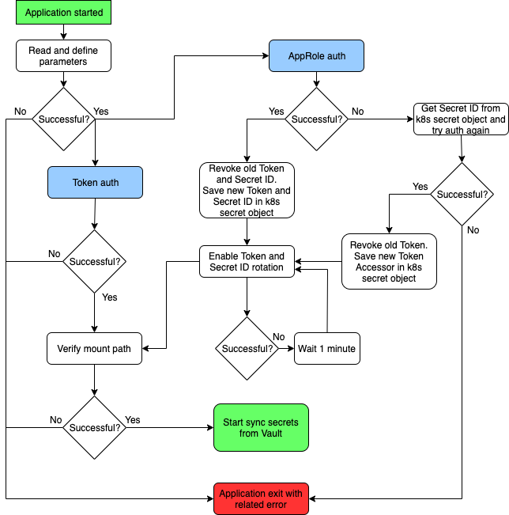
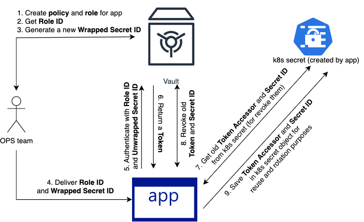
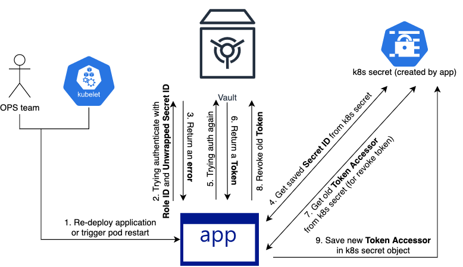

# Vault to K8S

Sync Secrets from Vault to Kubernetes. This is analog of tools like [vaultingkube](https://github.com/sunshinekitty/vaultingkube) and [vault-kubernetes](https://github.com/postfinance/vault-kubernetes) but with fixing some bugs and additional functional. Works with Vault KV Secrets Engine version 2.

- [Vault to K8S](#vault-to-k8s)
  - [Features and notes](#features-and-notes)
  - [How it works](#how-it-works)
    - [Versioning secrets](#versioning-secrets)
    - [Non-versioning secrets](#non-versioning-secrets)
    - [Diagram](#diagram)
  - [Auth methods](#auth-methods)
    - [AppRole auth method](#approle-auth-method)
      - [Description of AppRole auth logic](#description-of-approle-auth-logic)
      - [AppRole auth configuration](#approle-auth-configuration)
      - [Example of AppRole auth configuration](#example-of-approle-auth-configuration)
    - [Token auth method](#token-auth-method)
      - [Token auth configuration](#token-auth-configuration)
  - [Configuration](#configuration)
  - [Prometheus metrics](#prometheus-metrics)
    - [Configuration parameters](#configuration-parameters)
    - [Metrics](#metrics)

## Features and notes

- k8s secrets will be overwritten only if it has the annotation named as `ANNOTATION_NAME` and value of this annotation will be the path to secret in Vault

- Support versioning. The name of the secrets in the Kubernetes will contain a version of the secret.<br>
*Example:* name of secret in Vault `my-secret` with version `2` will have the name in Kubernetes `my-secret-v2`.<br>
Can be defined namespaces in `NON_VERSIONING_NAMESPACES` parameter (separated by comma) for which secrets should be created without adding version to name. In that case, in additional to versioning secrets, will be created k8s secrets with the same name as in Vault and with data from the last Vault secret version

- Support *token* and *secret_id* rotation if uses `AppAuth` method

- Doesn't have any logic to determine if Vault has changed and so it uses the `SYNC_INTERVAL` environment variable to determine how frequently (in seconds) it read secrets from Vault and send update requests to Kubernetes

- Can read from Vault and create/update secrets in Kubernetes in workers (threads) which significantly decreased sync time

- Doesn't have functional for delete secrets from Kubernetes

## How it works

After `vault-to-k8s` is running inside Kubernetes cluster it will look at the Vault server configured via environment variabled. Based on the `SECRETS_PATH_VAULT`, `K8S_CLUSTER_NAME` and `NON_VERSIONING_NAMESPACES` paramters it will read secrets from Vault and create/update secrets in Kubernetes by next rules:

### Versioning secrets

| SECRETS_PATH_VAULT | Path in Vault | k8s cluster | k8s namespace | k8s secret |
| --- | --- | --- | --- | --- |
| dir1/dirN | dir1/dirN/\<namespace\>/\<secret\> | all clusters | \<namespace\> | \<secret\>-v# |
| dir1/dirN | dir1/dirN/\<namespace\>/\<secret\>.\<cluster-name\> | \<cluster-name\> | \<namespace\> | \<secret\>.\<cluster-name\>-v# |

**Description:**

- Secret name can contain *\<cluster-name\>* (delimited by *dot*). This secret will be created on related cluster. Common secret (which doesn't have *\<cluster-name\>*) will be also created on that cluster
- Secret can have only 1 *dot*. Secrets with more 1 dots will be ignored
- Secrets which have *\<cluster-name\>* value different from the value defined for `K8S_CLUSTER_NAME` parameter will be ignored
- *#* - secret version in Vault

### Non-versioning secrets

| SECRETS_PATH_VAULT | Path in Vault | k8s cluster | k8s namespace | k8s secret |
| --- | --- | --- | --- | --- |
| dir1/dirN | dir1/dirN/\<namespace\>/\<secret\>.\<cluster-name\> | <cluster-name\> | \<namespace\> | \<secret\>|

**Description:**

- Non-versioning secrets will be created only for secrets which read from *\<namespace\>* defined in `NON_VERSIONING_NAMESPACES` parameter
- Kubernetes secret object won't be contain *\<namespace\>* in name
- Secrets which have *\<cluster-name\>* value different from the value defined for `K8S_CLUSTER_NAME` parameter will be ignored

**Note:** k8s secret name should meet requirements of DNS-1123 standard (must consist of lower case alphanumeric characters, '-' or '.', and must start and end with an alphanumeric character (e.g. 'example.com', regex used for validation is '[a-z0-9]\([-a-z0-9]*[a-z0-9]\)?(\.[a-z0-9]\([-a-z0-9]*[a-z0-9]\)?)*')). This mean that secrets with name which doesn't meet DNS-1123 standard can be created in Vault but they won't be synced to k8s.

### Diagram

<a href="images/vault-to-k8s.png"></a>

## Auth methods

This application support 2 auth methods:

- [AppRole](https://www.vaultproject.io/docs/auth/approle.html)
- [Token](https://www.vaultproject.io/docs/auth/token.html)

### AppRole auth method

Preferred method for use. This method support `token` and `secret_id` rotation (enabled by default). It's mean that you don't need care about rotation `token` and `secret_id` for application access to Vault. This process fully automated and controlled by application. Old `token` / `secret_id` will be revoked from Vault after rotation.

#### Description of AppRole auth logic

Application should be deployed with `role_id` and `wrapped secret_id` (the last one uses for avoid storing real `secret_id` in git or other unsafe place). For revoke/rotation `token` and `secret_id` application will create k8s secret object names as `<APP_NAME>-system`.
<br>There is 3 scenarios for application started with enabled AppRole auth:

1. Application started with valid `role_id` and `wrapped secret_id`.

    <a href="images/vault-to-k8s-approle_auth_vault.png"></a>

    - OPS team create `policy` and `role` in Vault (can be done via `terraform`). Get `Role ID` and `Wrapped Secret ID`
    - OPS team deploy application with defined `Role ID` and `Wrapped Secret ID` in k8s cluster
    - Once application started begins the process of authentication with provided `Role ID` and `Wrapped Secret ID`. Application unwrapping `Wrapped Secret ID` and trying authenticate in Vault
    - After successful authentication Vault return `Token`
    - Trying to get `Token Accessor` and `Secret ID` from k8s secret object
    - Revoking old `Token` and `Secret ID`, if `Token Accessor` and `Secret ID` was read successfully from k8s secret object
    - Save new `Token Accessor` and `Secret ID` in k8s secret object

2. Application started with valid `role_id` but invalid `wrapped secret_id`. Can happens during upgrade to new version (by OPS team) or due to Kubernetes rescheduling.

    <a href="images/vault-to-k8s-approle_auth_k8s-secret.png"></a>

    - Once application started begins the process of authentication with provided `Role ID` and `Wrapped Secret ID`. Application unwrapping `Wrapped Secret ID` and trying authenticate in Vault
    - Vault server return an error
    - Application trying to get `Secret ID` from k8s secret object
    - If `Secret ID` was read successfully from k8s secret object, application trying authenticate in Vault with this one `Secret ID`
    - If `Secret ID` not expired, Vault return `Token`
    - Reading `Token Accessor` from k8s secret object
    - Revoking old `Token`
    - Save new `Token Accessor` in k8s secret object

3. Application started with invalid `role_id` or/and invalid `wrapped secret_id`. Also, `secret_id` not stored in k8s secret object or it expired.

    In that case application will exit with related error.

After successful authentication will be enabled `token` and `secret_id` rotation (if it not disabled via configuration). Each 1 minute will be triggered retry, if by some reasons `token` or `secret_id` can't be rotated.

#### AppRole auth configuration

| Environment variable | Command line parameter | Description|
| --- | --- | --- |
| AUTH_METHOD | auth_method | Should be defined as `approle` |
| APPROLE_ROLE_ID | approle_role_id | Vault `role_id` value |
| APPROLE_SECRET_ID_WRAPPED_TOKEN | approle_secret_id_wrapped_token | Vault `wrapping_token` value. `APPROLE_SECRET_ID_WRAPPED_TOKEN_FILE` should be undefined |
| APPROLE_SECRET_ID_WRAPPED_TOKEN_FILE | approle_secret_id_wrapped_token_file | File name (with path) which contain Vault `wrapping_token`. If not defined, `APPROLE_SECRET_ID_WRAPPED_TOKEN` will be used instead |
| TOKEN_ROTATION_INTERVAL | token_rotation_interval | Interval (in seconds) for `token` rotation. If not defined it will be calculated by formula `'token_ttl * 0.7'`. For disable `token` rotation set value to `0` |
| APPROLE_SECRETID_ROTATION_INTERVAL | approle_secretid_rotation_interval | Interval (in seconds) for `secret_id` rotation. If not defined it will be calculated by formula `'secret_id_ttl * 0.7'`. For disable `secret_id` rotation set value to `0` |

#### Example of AppRole auth configuration

**Requirements**

 - read-only access to `mydir/k8s/*` path (for read secrets)
 - configured permissions for `token` and `secret_id` rotation
 - `token_ttl` 24 hours and configured `token` rotation each 12 hours
 - `secret_id_ttl` 3 months and configured `secret_id` rotation each 1 month

**Implementation**

- Create file `vault-policy.hcl` with rules for `policy`
  
  ```bash
  # Access to secrets
  path "mydir/k8s/*"  {
    capabilities = ["read", "list"]
  }

  # Read mounts
  path "sys/mounts"  {
    capabilities = ["read"]
  }

  # List metadata
  path "mydir/metadata/k8s/*"  {
    capabilities = ["list"]
  }

  # Read data
  path "mydir/data/k8s/*"  {
    capabilities = ["read"]
  }

  # Lookup 'secret_id'
  path "auth/approle/role/vault-to-k8s/secret-id/lookup"  {
    capabilities = ["update"]
  }

  # Create 'secret_id'
  path "auth/approle/role/vault-to-k8s/secret-id"  {
    capabilities = ["update"]
  }

  # Revoke 'token' and 'token accessor'
  path "auth/token/revoke-accessor"  {
    capabilities = ["update"]
  }

  # Revoke 'secret_id' and 'secret_id_accessor'
  path "auth/approle/role/vault-to-k8s/secret-id-accessor/destroy"  {
    capabilities = ["update"]
  }
  ```

- Create `policy` named `vault-to-k8s`:

    ```bash
    vault policy write vault-to-k8s vault-policy.hcl
    ```

- Create `AppRole` named as `vault-to-k8s` with attached policy `vault-to-k8s`

    ```bash
    $ vault write auth/approle/role/vault-to-k8s \
        policies=vault-to-k8s \
        token_ttl=24h \
        secret_id_ttl=2190h
    ```

- Fetch `Role ID`

    ```bash
    vault read auth/approle/role/vault-to-k8s/role-id
    ```

- Generate `Wrapped Secret ID` with 10m ttl

    ```bash
    vault write -wrap-ttl=10m -f auth/approle/role/vault-to-k8s/secret-id
    ```

- Application configuration

    ```bash
    AUTH_METHOD=approle
    APPROLE_ROLE_ID=<role_id>
    APPROLE_SECRET_ID_WRAPPED_TOKEN=<wrapping_token>
    TOKEN_ROTATION_INTERVAL=43200
    APPROLE_SECRETID_ROTATION_INTERVAL=2630000
    ```

### Token auth method

Simple auth method by passing already generated "token" to application (via `VAULT_TOKEN` parameter). Should be used for debug/testing purposes only. Token rotation won't be enabled for this auth type.

#### Token auth configuration

| Environment variable | Command line parameter | Description|
| --- | --- | --- |
| AUTH_METHOD | auth_method | Should be defined as `token` |
| VAULT_TOKEN | vault_token | Vault token |

## Configuration

| Environment variable | Command line parameter | Default value | Description |
| --- | --- | --- | --- |
| DEBUG | debug | false | Log debug |
| VAULT_ADDR | vault_addr | - | Vault server address. **Required** to set |
| VAULT_NAMESPACE | vault_namespace | - | Vault namespace. **Required** to set |
| APP_NAME | app_name | vault-to-k8s | Application name. This is a part of application k8s secret which will be created when enabled `AppRole` auth type, the 2nd part of which is `-system` |
| POD_NAMESPACE | pod_namespace | - | Should be defined if "autodetect" not working by some reasons |
| AUTH_METHOD | auth_method | - | Can be `token` or `approle`. **Required** to set |
| NUM_WORKERS | num_workers | 1 | Number of workers for read/create/update secrets |
| SYNC_INTERVAL | sync_interval | 300 | How many seconds to wait between syncs |
| K8S_CLUSTER_NAME | k8s_cluster_name | - | The name of the Kubernetes cluster where the application is running. **Required** to set |
| SECRETS_PATH_VAULT | secrets_path_vault | - | Path to secrets in Vault. **Required** to set |
| NON_VERSIONING_NAMESPACES | non_versioning_namespaces | - | Non-versioning namespaces, separated by comma |
| ANNOTATION_NAME | annotation_name | vault-to-k8s/secret | Kubernetes annotation name |

## Prometheus metrics

### Configuration parameters

| Environment variable | Command line parameter | Default value | Description |
| --- | --- | --- | --- |
| PROMETHEUS_METRICS | prometheus_metrics | true | Enable/disable Prometheus metrics |
| PROMETHEUS_LISTEN_ADDRESS | prometheus_listen_address | :9703 | Address on which expose metrics and web interface |
| PROMETHEUS_METRICS_PATH | prometheus_metrics_path | /metrics | Path under which to expose metrics |

### Metrics

| Metric name | Type | Labels | Description | Values |
| --- | --- | --- | --- | --- |
| vtk_sync_time | gauge | - | How long the sync run took | ns |
| vtk_sync_count | counter | - | How many times sync was running since application start | number |
| vtk_sync_status | gauge | namespace | Status of sync | 0 - unsuccessful, 1 - successful |
| vtk_secrets_created | gauge | namespace | How many secrets were created in k8s during sync cycle | number |
| vtk_secrets_updated | gauge  | namespace | How many secrets were updated in k8s during sync cycle | number |
| vtk_secrets_skipped | gauge | namespace | How many secrets were skipped during sync cycle | number |
| vtk_secrets_synced | gauge | namespace | How many secrets were synced during sync cycle | number |
| vtk_auth_approle_secret_id | gauge | type | AppRole Secret ID rotation info | see below |
| vtk_auth_token | gauge | type | Token rotation info | see below |

Labels `type` for metrics `vtk_auth_approle_secret_id`:

| Label type | Description | Values |
|------------|-------------|--------|
| rotation-status | Secret ID rotation status | 0 - unsuccessful, 1 - successful |
| last-rotation-status | Status of last Secret ID rotation | 0 - unsuccessful, 1 - successful |
| next-rotation-timestamp | Timestamp of next Secret ID rotation | timestamp |
| error-revoke-secret-id | Errors during revoke Secret ID | 0 - no errors, 1 - errors (check logs) |

Labels `type` for metrics `vtk_auth_token`:

| Label type | Description | Values |
|------------|-------------|--------|
| last-rotation-status | Status of last Token rotation | 0 - unsuccessful, 1 - successful |
| next-rotation-timestamp | Timestamp of next Token rotation | timestamp |
| error-revoke-token | Errors during revoke Token | 0 - no errors, 1 - errors (check logs) |
| error-save-token-accessor-in-k8s-secret | Errors during save Token Accessot in k8s secret | 0 - no errors, 1 - errors (check logs) |
